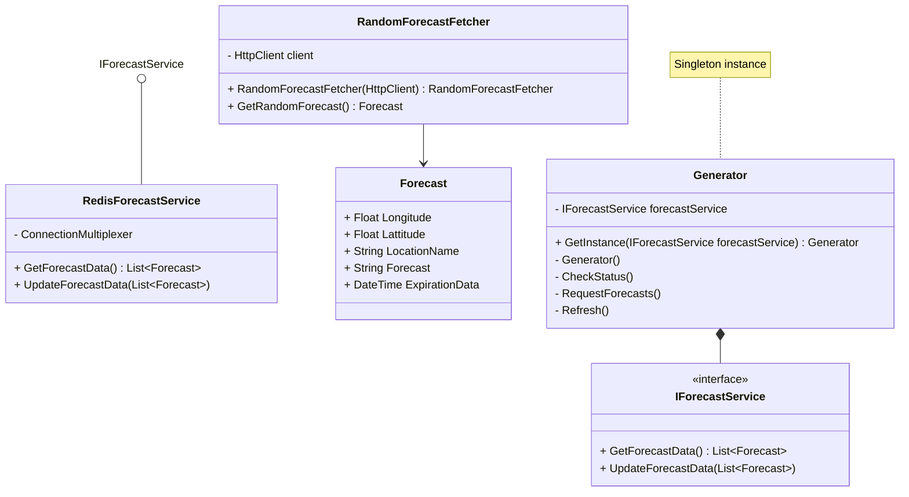

# Test Project

## Project Bootstrap

### Tools

- [Mermaid Chart for Visual Studio Code](https://marketplace.visualstudio.com/items?itemName=MermaidChart.vscode-mermaid-chart)
- [Mermaid Class Diagrams Documentation](https://mermaid.ai/open-source/syntax/classDiagram.html)

### Project templates

``` bash
# Enumerate templates
dotnet new list
# Web API Project
dotnet new webapi --name AerostratWebAPI --output AerostratWebAPI --use-controllers --use-program-main
# Angular.JS SPA
dotnet new angular --name AerostratSPA --output AerostratSPA --use-program-main
# Background Service
dotnet new worker --name AerostratWorker --output AerostratWorker --use-program-main

# Redis package
dotnet add package StackExchange.Redis
```

## Get Redis

[Install instructions](https://redis.io/docs/latest/operate/oss_and_stack/install/install-stack/)

The fastest way to run Redis is with Docker:

``` bash
# Start docker daemon by opening the Docker app on MacOS
# Run redis as a docker container
docker run -d --name redis -p 6379:6379 redis
```

Install Redis Insight to manage Redis via UI

[Download Redis Insight](https://redis.io/insight/)

Connect Redis Insight to your docker instance using this connection string

``` text
redis://localhost:6379
```

---

## System Design

### Worker Role

---



Generator logic:

- CheckStatus: Check the forecast data source every X minutes for evicted forecast and enqueue new work if needed.
- RequestForecasts: Create a pool of workers to fetch forecast data, once the pool is done executing, call refresh with the new data. Check if the requirement was fullfilled if it wasnt log it, no need to re enqueue since check status will re enqueue eventually.
- Refresh: Upon completion of work from the workers, refresh the forecast data, save it to the forecast data source.

Random Forecast Fetcher Logic

- GetForecast: Execute the required requests to fetch a new random forecast, use exponential backoff with jitters and a circuit breaker.

### Web Backend Role

- Load random forecasts
    REST /forecasts/random

---

## To Learn - Concurrency

In C#, you can implement a worker pool using three different approaches depending on your specific requirements: using the modern **`ActionBlock<T>`** for a dataflow-driven approach, utilizing built-in **`Parallel.ForEachAsync`** for a simple asynchronous task loop, or building a custom **`Channel<T>`** pattern for maximum flexibility. [[1](https://stackoverflow.com/questions/435668/code-for-a-simple-thread-pool-in-c-sharp)]

---

Method 1: The Modern & Recommended Way (`ActionBlock<T>`)

The easiest and most robust way to create a worker pool with a strict concurrency limit is using the `ActionBlock<T>` class from the `System.Threading.Tasks.Dataflow` namespace.

``` csharp
using System;
using System.Threading.Tasks;
using System.Threading.Tasks.Dataflow;

class Program
{
    static async Task Main()
    {
        // 1. Initialize the block with a maximum degree of parallelism (worker count)
        var workerPool = new ActionBlock<int>(async jobId =>
        {
            Console.WriteLine($"[Worker] Processing job {jobId} on Thread {Environment.CurrentManagedThreadId}");
            await Task.Delay(1000); // Simulate asynchronous work
        }, new ExecutionDataflowBlockOptions
        {
            MaxDegreeOfParallelism = 3 // Max 3 active workers at a time
        });

        // 2. Post jobs to the worker pool
        for (int i = 1; i <= 10; i++)
        {
            workerPool.Post(i);
        }

        // 3. Signal completion and wait for workers to drain the queue
        workerPool.Complete();
        await workerPool.Completion;

        Console.WriteLine("All jobs completed.");
    }
}
```

---

Method 2: The Loop Approach (`Parallel.ForEachAsync`)

If you already have a predefined collection of items or jobs to process concurrently, `Parallel.ForEachAsync` is the cleanest option available in modern .NET.


``` csharp
using System;
using System.Linq;
using System.Threading;
using System.Threading.Tasks;

class Program
{
    static async Task Main()
    {
        var jobs = Enumerable.Range(1, 10);
        
        var options = new ParallelOptions 
        { 
            MaxDegreeOfParallelism = 3 // Limits the pool to 3 concurrent tasks
        };

        // Processes jobs concurrently up to the MaxDegreeOfParallelism limit
        await Parallel.ForEachAsync(jobs, options, async (jobId, cancellationToken) =>
        {
            Console.WriteLine($"[Worker] Processing job {jobId}");
            await Task.Delay(1000); 
        });

        Console.WriteLine("All jobs completed.");
    }
}
```

---

Method 3: The Traditional Producer-Consumer Pattern (`Channel<T>`)

If you require a long-lived architecture where jobs are continuously pushed from different areas of your app and picked up by a fixed number of background worker threads, use the high-performance `System.Threading.Channels` framework. [[1](https://www.iamraghuveer.com/posts/csharp-channels-pipelines/)]


``` csharp
using System;
using System.Threading.Channels;
using System.Threading.Tasks;

class Program
{
    static async Task Main()
    {
        // 1. Create a thread-safe, bounded channel queue
        var channel = Channel.CreateBounded<int>(100);
        int workerCount = 3;
        Task[] workers = new Task[workerCount];

        // 2. Start your background worker threads
        for (int i = 0; i < workerCount; i++)
        {
            int workerId = i;
            workers[i] = Task.Run(async () =>
            {
                // Workers will read from the channel until it is marked complete
                await foreach (var jobId in channel.Reader.ReadAllAsync())
                {
                    Console.WriteLine($"Worker {workerId} is processing job {jobId}");
                    await Task.Delay(1000); 
                }
            });
        }

        // 3. Producer pushes items to the queue
        for (int i = 1; i <= 10; i++)
        {
            await channel.Writer.WriteAsync(i);
        }

        // 4. Close the channel and wait for the workers to finish remaining work
        channel.Writer.Complete();
        await Task.WhenAll(workers);

        Console.WriteLine("All jobs completed.");
    }
}
```

