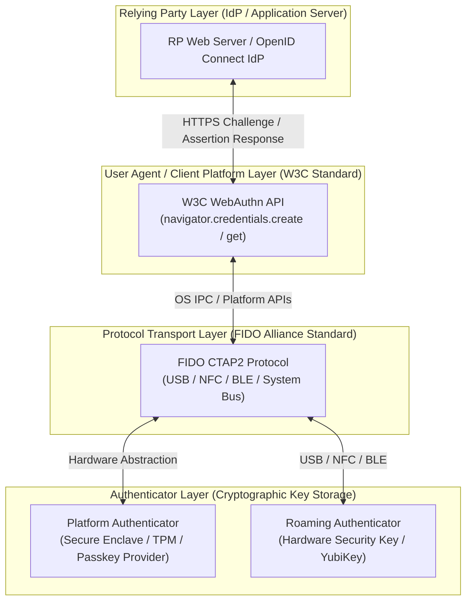

What is a Passkey? (Disambiguating WebAuthn and Passkeys)
========================================================

In the evolving landscape of Identity and Access Management (IAM), few concepts have introduced as much terminology overload and initial confusion as "Passkeys." Consumer media, operating system vendors, and security marketing often use "Passkeys," "WebAuthn," and "FIDO2" interchangeably. [^1] For identity architects, security engineers, and CIDPRO-certified practitioners, maintaining precise technical nomenclature is critical when designing enterprise authentication architectures, evaluating risk profiles, and establishing compliance policies. [^2]

At its core, a **Passkey** is a consumer-friendly brand name established by the FIDO Alliance for a specific cryptographic credential format: a **discoverable FIDO credential** backed by asymmetric public-key cryptography. [^3] However, the underlying technology that enables passkeys is built upon a layered stack of open standards governed by independent standards bodies, primarily the World Wide Web Consortium (W3C) and the FIDO Alliance. [^4]

Understanding the Standards Stack: WebAuthn, FIDO2, and CTAP2
------------------------------------------------------------

To disambiguate these technologies, IAM architects must analyze the authentication framework across three distinct operational layers:

1. **Web Authentication (WebAuthn)**: The browser-facing and application-facing API layer. Standardized by the W3C Web Authentication Working Group, WebAuthn defines a set of JavaScript APIs (`navigator.credentials.create()` for registration and `navigator.credentials.get()` for authentication) exposed by user agents (web browsers and mobile operating systems) to Relying Parties (RPs). [^5] WebAuthn defines the payload structures, cryptographic challenge-response mechanisms, and attestation data types exchanged between the web application and the client platform.

2. **FIDO Alliance FIDO2**: The overarching umbrella standard and architectural framework that unites web-level authentication with client hardware capabilities. FIDO2 represents the evolution beyond legacy FIDO U2F (Universal 2nd Factor) and FIDO UAF (Universal Authentication Framework) standards, enabling passwordless, multi-factor authentication natively supported across modern operating systems. [^6]

3. **Client to Authenticator Protocol 2 (CTAP2)**: The low-level transport and messaging protocol standardized by the FIDO Alliance. CTAP2 governs how the client platform (e.g., modern web browsers, macOS, Windows, iOS, Android) communicates directly with external or integrated authenticators over physical channels such as USB, Near Field Communication (NFC), Bluetooth Low Energy (BLE), or internal system buses. [^7]

Figure 1. Architectural relationship between W3C WebAuthn API, FIDO2 framework, CTAP2, and Authenticator layers.

Syncable (Multi-Device) vs. Hardware-Bound (Single-Device) Passkeys
------------------------------------------------------------------

From an IAM governance standpoint, the most vital distinction within the passkey paradigm is the operational difference between **Syncable (Multi-Device) Passkeys** and **Hardware-Bound (Single-Device) Passkeys**. [^8]

While both types utilize identical asymmetric cryptographic principles—where a public key is registered with the Relying Party and a private key is securely managed by an authenticator—their credential storage, backup, and lifecycle characteristics differ fundamentally:

* **Syncable Passkeys (Multi-Device Credentials)**: Managed by platform credential managers (such as Apple iCloud Keychain, Google Password Manager, Microsoft Wallet) or third-party password managers (1Password, Bitwarden). The private key is synchronized across a user's ecosystem of devices using end-to-end encryption (E2EE), protected by the user's primary cloud account authentication and device escrow key. [^8] Syncable passkeys prioritize user convenience, eliminating account lockout risks when a single device is lost or upgraded.

* **Hardware-Bound Passkeys (Single-Device Credentials)**: Stored inside non-exportable hardware authenticators (such as FIPS-certified YubiKeys or dedicated platform Trusted Platform Modules [TPMs]). The private key is cryptographically bound to the specific physical silicon chip and can never leave or be synchronized across devices. [^7] Hardware-bound passkeys provide strict non-repudiation and maximum phishing protection required for high-assurance enterprise environments, Privileged Access Management (PAM), and critical infrastructure compliance.

| Architectural Dimension | Syncable (Multi-Device) Passkey | Hardware-Bound (Single-Device) Passkey |
| :--- | :--- | :--- |
| **Primary Use Case** | Consumer applications & standard enterprise workforce | High-assurance IAM, Privileged Access (PAM), Regulatory Compliance |
| **Credential Synchronization** | Cloud synchronized via End-to-End Encryption (E2EE) | Cryptographically bound to single physical silicon chip (No sync) |
| **Device Loss Recovery** | Automatic recovery via cloud ecosystem escrow | Out-of-band admin re-enrollment or secondary security key |
| **Attestation Capability** | Anonymized platform attestation or enterprise policy override | Hardware attestation (AAGUID verification, FIPS certificates) |
| **Phishing Resistance** | Absolute origin binding (100% AitM phishing resistant) | Absolute origin binding (100% AitM phishing resistant) |

Key Cryptographic Principles for IAM Architects
----------------------------------------------

Underneath the user interface, passkeys rely on established Public Key Infrastructure (PKI) concepts adapted for origin-bound authentication. [^9] Unlike traditional PKI, which relies on centralized Certificate Authorities (CAs) and complex certificate revocation lists (CRLs), WebAuthn passkeys establish a direct trust relationship between the user's authenticator and the Relying Party. [^5]

1. **KeyPair Generation & Scoping**: During registration, the authenticator generates a unique asymmetric key pair (typically ECC P-256 or Ed25519) strictly scoped to the Relying Party's domain origin (e.g., `idp.example.com`).
2. **Elimination of Shared Secrets**: The private key never leaves the authenticator's secure boundary. The public key is stored by the IdP alongside the user profile.
3. **User Verification (UV) vs. User Presence (UP)**: Standardized IAM vocabulary distinguishes between validating that a human touched the device (**User Presence**) and validating that the human authorized the action via local biometrics or PIN (**User Verification**). [^10]

By grounding passkey deployments in these standard specifications, IAM teams can effectively navigate enterprise requirements, balance security against user friction, and establish vendor-neutral identity architectures. [^11]

---

1. [WRONG] Espen Bago, "Words of Identity," IDPro Body of Knowledge, 29 September 2022, <https://bok.idpro.org/article/id/86/>.

2. [WRONG]  Heather Flanagan, "Terminology in the IDPro Body of Knowledge," IDPro Body of Knowledge, 31 March 2020, <https://bok.idpro.org/article/id/41/>.

3. FIDO Alliance, "Passkeys Overview," FIDO Alliance Resource Center, <https://fidoalliance.org/passkeys/>.

4. [WRONG] IDPro Committee, "Independent IAM Organizations," IDPro Body of Knowledge, 2022, <https://bok.idpro.org/article/id/87/>.

5. W3C Web Authentication Working Group, "Web Authentication: An API for accessing Public Key Credentials (WebAuthn)," W3C Specification, <https://w3c.github.io/webauthn/>.

6. FIDO Alliance, "FIDO Alliance Overview," FIDO Alliance Documentation, <https://fidoalliance.org/overview/>.

7. Yubico Developer Program, "Quick Overview of WebAuthn, FIDO2, and CTAP," Yubico Passkeys Documentation, <https://developers.yubico.com/Passkeys/Quick_overview_of_WebAuthn_FIDO2_and_CTAP.html>.

8. Wikipedia contributors, "Passkey (credential)," Wikipedia, The Free Encyclopedia, <https://en.wikipedia.org/wiki/Passkey_(credential)>.

9. Robert Sherwood, "Practical Implications of Public Key Infrastructure for Identity Professionals," IDPro Body of Knowledge, 2022, <https://bok.idpro.org/article/id/80/>.

10. Wikipedia contributors, "WebAuthn," Wikipedia, The Free Encyclopedia, <https://en.wikipedia.org/wiki/WebAuthn>.

11. Microsoft Security, "What is a Passkey? Security 101," Microsoft Security Center, <https://www.microsoft.com/en-my/security/business/security-101/what-is-passkey>.
